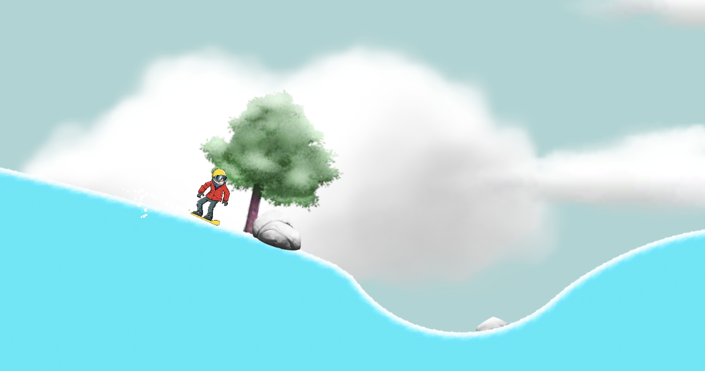

# 🏂 Snow Boarder - Unity 2D

An engaging game where players control a snowboarder navigating snowy terrains. The game features smooth mechanics, obstacles, and thrilling gameplay that captures the excitement of snowboarding.

Link: [https://anshusinha26.github.io/Snow-Boarder](https://anshusinha26.github.io/Snow-Boarder)

---

## 📸 Screenshots

---

## ✨ Features

- Dynamic Gameplay: Players control a snowboarder gliding through snow-covered landscapes.
- Obstacle Avoidance: Adds challenge with dynamic and static obstacles.
- Smooth Controls: Optimized mechanics for a realistic snowboarding experience.

---

## ⚙️ Tech Stack

- Unity: Game engine for building 2D environments and mechanics.
- C#: Primary programming language for scripting game logic.
